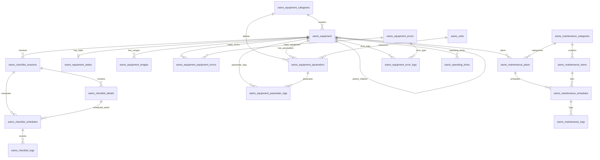

# EAM MES Package — Modules và Database

Tài liệu này mô tả các module, model, migration và quan hệ dữ liệu hiện có trong package.

## 1. Cấu trúc module

| Module | Đường dẫn | Phạm vi |
|---|---|---|
| Masterdata Equipment | `src/Modules/Masterdata/Equipment` | Thiết bị, category, state, image, parameter, unit và equipment error |
| Checklist | `src/Modules/Equipment/Checklist` | Session kiểm tra, detail, schedule và log kết quả |
| Maintenance | `src/Modules/Equipment/Maintenance` | Category, item, plan, schedule và log bảo trì |
| Error Monitoring | `src/Modules/Equipment/ErrorMonitoring` | Error log và operating time |
| Parameter Log | `src/Modules/Equipment/ParameterLog` | Log thông số thiết bị |
| Extension | `src/Models` và `src/Extensions` | Theo dõi yêu cầu mở rộng schema động |

Mỗi model nghiệp vụ có nhóm `Actions` CRUD skeleton tương ứng. Các action hiện chỉ trả `response()->json([])` để ứng dụng host triển khai business logic sau.

## 2. Quy ước database

- Tất cả bảng nghiệp vụ dùng tiền tố `eamo_`.
- Các ID nghiệp vụ chính dùng chuỗi UUID dài 36 ký tự.
- Các bảng gán user trực tiếp dùng `user_id`; package không tạo pivot user riêng.
- `eamo_equipment_equipment_errors` vẫn là pivot nghiệp vụ giữa equipment và equipment error.
- Các bảng có FK tới `users` giả định ứng dụng host đã có bảng `users` với khóa UUID.

## 3. Danh sách bảng và model

| Bảng | Model | Module |
|---|---|---|
| `eamo_equipment_categories` | `EquipmentCategory` | Masterdata Equipment |
| `eamo_equipment` | `Equipment` | Masterdata Equipment |
| `eamo_equipment_states` | `EquipmentState` | Masterdata Equipment |
| `eamo_equipment_images` | `EquipmentImage` | Masterdata Equipment |
| `eamo_equipment_parameters` | `EquipmentParameter` | Masterdata Equipment |
| `eamo_units` | `Unit` | Masterdata Equipment |
| `eamo_equipment_errors` | `EquipmentError` | Masterdata Equipment |
| `eamo_equipment_equipment_errors` | `EquipmentEquipmentError` | Masterdata Equipment |
| `eamo_checklist_sessions` | `ChecklistSession` | Checklist |
| `eamo_checklist_details` | `ChecklistDetail` | Checklist |
| `eamo_checklist_schedules` | `ChecklistSchedule` | Checklist |
| `eamo_checklist_logs` | `ChecklistLog` | Checklist |
| `eamo_equipment_parameter_logs` | `EquipmentParameterLog` | Parameter Log |
| `eamo_equipment_error_logs` | `EquipmentErrorLog` | Error Monitoring |
| `eamo_operating_times` | `OperatingTime` | Error Monitoring |
| `eamo_maintenance_categories` | `MaintenanceCategory` | Maintenance |
| `eamo_maintenance_items` | `MaintenanceItem` | Maintenance |
| `eamo_maintenance_plans` | `MaintenancePlan` | Maintenance |
| `eamo_maintenance_schedules` | `MaintenanceSchedule` | Maintenance |
| `eamo_maintenance_logs` | `MaintenanceLog` | Maintenance |
| `eamo_extension_requests` | `Spatie\LaravelPackageTools\Models\ExtensionRequest` | Extension |

## 4. Quan hệ dữ liệu

## 5. Các cột quan trọng

### Equipment và master data

- `eamo_equipment`: `id`, `parent_id`, `code`, `equipment_category_id`, `name`, `device_id`, `maintenance_interval_hours`, `last_maintenance`, `is_active`.
- `eamo_equipment_parameters`: `id`, `code`, `equipment_id`, `product_category_id`, `equipment_category_id`, `unit_id`, `name`, `standard`, `standard_min`, `standard_max`.
- `eamo_equipment_states`: một state cho mỗi equipment thông qua unique `equipment_id`.
- `eamo_equipment_equipment_errors`: khóa chính ghép `equipment_id + equipment_error_id`.

### Checklist

- `eamo_checklist_sessions`: `equipment_id`, `user_id`, `session_date`, `cycle_type`, `cycle_interval`.
- `eamo_checklist_details`: thuộc một session qua `session_id`.
- `eamo_checklist_schedules`: `equipment_id`, `checklist_session_id`, `checklist_detail_id`, `user_id`, `date`, `is_rescheduled`, `original_date`.
- `eamo_checklist_logs`: `checklist_schedule_id`, `user_id`, `result` (`pass|fail`), `status` (`pending|completed`), `checked_at`.

### Maintenance

- `eamo_maintenance_plans`: kế hoạch theo equipment, category và `user_id`; có `occurrences` cho chu kỳ.
- `eamo_maintenance_items`: thuộc category và có `user_id` trực tiếp.
- `eamo_maintenance_schedules`: thuộc plan/item/equipment và có `user_id`, trạng thái reschedule.
- `eamo_maintenance_logs`: thuộc một maintenance schedule qua `maintenance_schedule_id`.

### Logging

- `eamo_equipment_parameter_logs`: liên kết equipment, parameter và unit.
- `eamo_equipment_error_logs`: liên kết equipment, loại error và `handler_id` tới user host.
- `eamo_operating_times`: lưu thời gian hoạt động, planned/unplanned stop và availability factor.

## 6. Migration

Migration nằm tại `database/migrations`. Package giữ các migration hiện có và đã tích hợp các bảng bổ sung vào migration phù hợp, không tạo thêm migration riêng cho các pivot user.

Kiểm tra hiện tại:

- 21 bảng package có model tương ứng.
- Toàn bộ migration package chạy thành công qua `EamMesMigrationsTest`.
- CRUD action skeleton không thực hiện truy vấn hoặc mutation dữ liệu.
