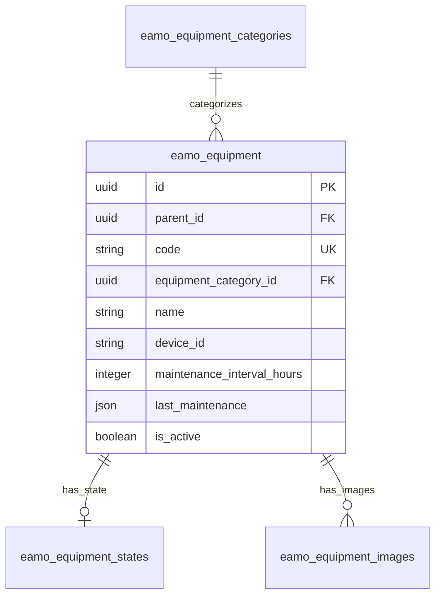
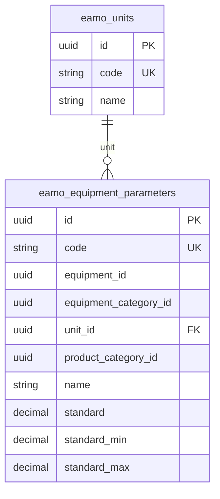
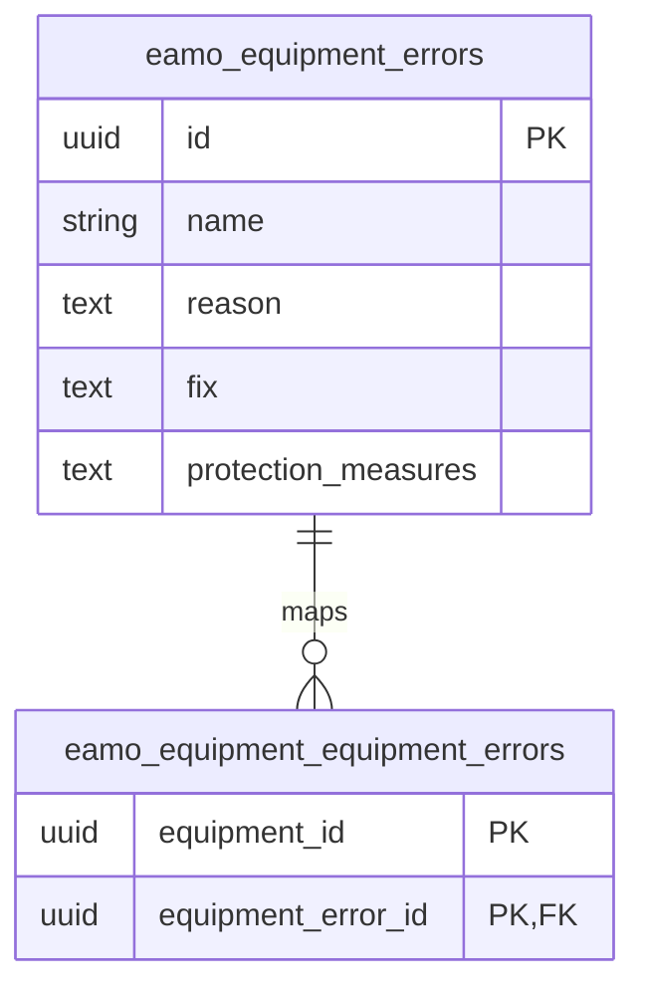
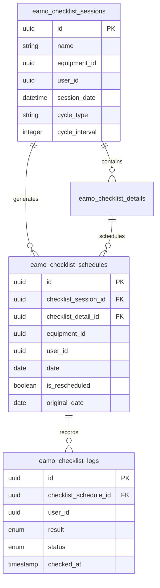
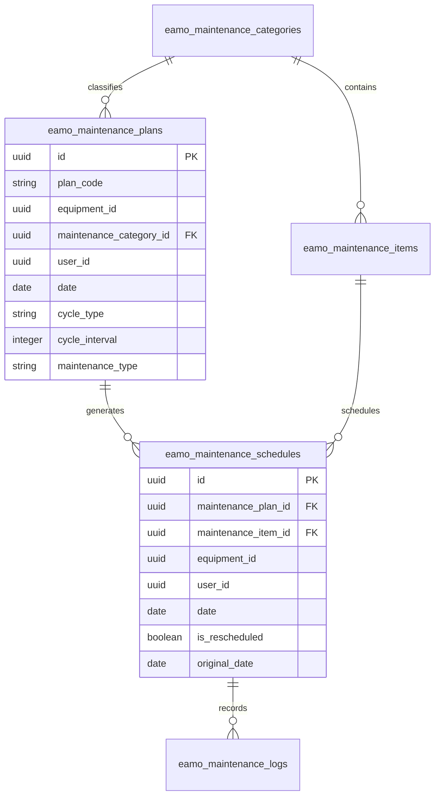
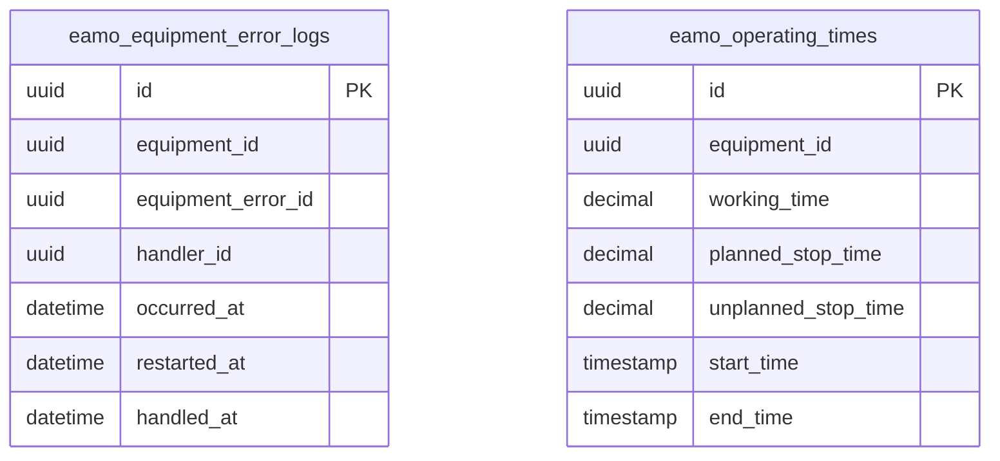
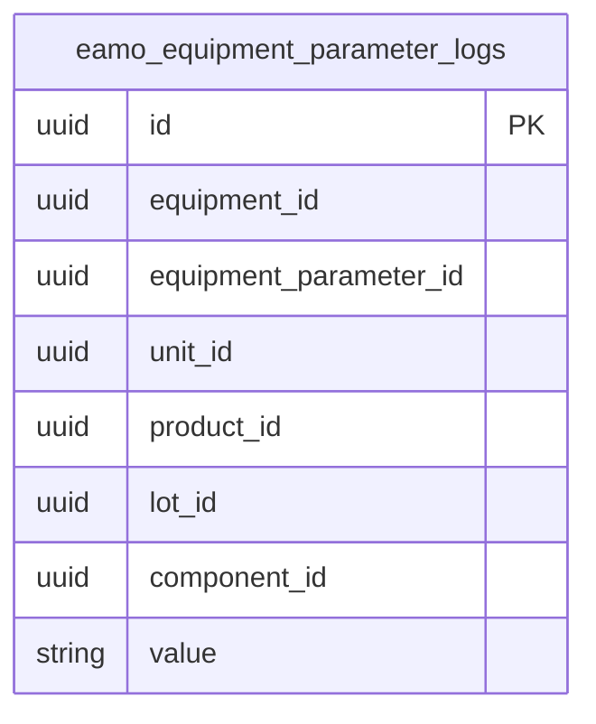

# EAM MES Package — Modules và Database

Tài liệu này phản ánh schema thực tế trong `database/migrations` của package.

## Quy ước đọc sơ đồ

- Sơ đồ được tách theo đúng ranh giới module/model.
- Chỉ vẽ đường quan hệ khi hai bảng thuộc cùng một submodule.
- Các cột tham chiếu sang module khác hoặc sang ứng dụng host vẫn được liệt kê, nhưng không nối đường trên ERD.
- `users`, product, lot, checklist và các master data ngoài package là dependency của host app.

## 1. Tổng quan toàn bộ database

| Submodule | Bảng | Vai trò | Quan hệ nội bộ hiển thị |
|---|---|---|---|
| Masterdata Equipment | `eamo_equipment_categories`, `eamo_equipment`, `eamo_equipment_states`, `eamo_equipment_images` | Thiết bị cốt lõi | Category → Equipment → State / Images |
| Masterdata Equipment | `eamo_units`, `eamo_equipment_parameters` | Thông số và đơn vị đo | Unit → Equipment parameters |
| Masterdata Equipment | `eamo_equipment_errors`, `eamo_equipment_equipment_errors` | Danh mục lỗi và pivot mapping | Equipment error → Pivot |
| Checklist | `eamo_checklist_sessions`, `eamo_checklist_details`, `eamo_checklist_schedules`, `eamo_checklist_logs` | Lập lịch và thực hiện checklist | Session → Detail / Schedule → Log |
| Maintenance | `eamo_maintenance_categories`, `eamo_maintenance_items`, `eamo_maintenance_plans`, `eamo_maintenance_schedules`, `eamo_maintenance_logs` | Lập kế hoạch và log bảo trì | Category → Item / Plan → Schedule → Log |
| Error Monitoring | `eamo_equipment_error_logs`, `eamo_operating_times` | Log lỗi và vận hành | Bảng log độc lập |
| Parameter Log | `eamo_equipment_parameter_logs` | Timeseries thông số | Bảng log độc lập |
| Extension | `eamo_extension_requests` | Theo dõi migration động | Bảng độc lập |

## 2. Masterdata Equipment

| Bảng | Model | Mục đích |
|---|---|---|
| `eamo_equipment_categories` | `EquipmentCategory` | Danh mục thiết bị |
| `eamo_equipment` | `Equipment` | Thiết bị, cấu trúc cha–con |
| `eamo_equipment_states` | `EquipmentState` | Trạng thái 1–1 của thiết bị |
| `eamo_equipment_images` | `EquipmentImage` | Ảnh thiết bị |
| `eamo_equipment_parameters` | `EquipmentParameter` | Thông số, ngưỡng chuẩn |
| `eamo_units` | `Unit` | Đơn vị đo |
| `eamo_equipment_errors` | `EquipmentError` | Danh mục lỗi |
| `eamo_equipment_equipment_errors` | `EquipmentEquipmentError` | Pivot equipment–error |

`parent_id` là self-reference của equipment nên chỉ hiển thị là cột; không vẽ line vòng lặp.

### 2.1 Thông số và đơn vị đo

`equipment_id`, `equipment_category_id` và `product_category_id` là các ID tham chiếu ra ngoài sơ đồ nhỏ này.

### 2.2 Danh mục lỗi

`equipment_id` trong pivot tham chiếu sang sơ đồ thiết bị cốt lõi nên không nối line.

## 3. Mô hình dữ liệu vận hành & logs

### 3.1 Checklist

| Bảng | Model | Cột liên kết ngoài module |
|---|---|---|
| `eamo_checklist_sessions` | `ChecklistSession` | `equipment_id`, `user_id` |
| `eamo_checklist_details` | `ChecklistDetail` | `checklist_id` |
| `eamo_checklist_schedules` | `ChecklistSchedule` | `equipment_id`, `user_id` |
| `eamo_checklist_logs` | `ChecklistLog` | `user_id` |

### 3.2 Maintenance

| Bảng | Model | Cột liên kết ngoài module |
|---|---|---|
| `eamo_maintenance_categories` | `MaintenanceCategory` | — |
| `eamo_maintenance_items` | `MaintenanceItem` | `user_id` |
| `eamo_maintenance_plans` | `MaintenancePlan` | `equipment_id`, `user_id` |
| `eamo_maintenance_schedules` | `MaintenanceSchedule` | `equipment_id`, `user_id` |
| `eamo_maintenance_logs` | `MaintenanceLog` | — |

### 3.3 Error Monitoring

`eamo_equipment_error_logs` và `eamo_operating_times` là hai bảng log độc lập trong submodule này. Các ID `equipment_id`, `equipment_error_id` và `handler_id` tham chiếu sang Masterdata/host app nên không vẽ line ở đây.

| Bảng | Model | Cột chính |
|---|---|---|
| `eamo_equipment_error_logs` | `EquipmentErrorLog` | `equipment_id`, `equipment_error_id`, `occurred_at`, `restarted_at`, `handled_at`, `handler_id` |
| `eamo_operating_times` | `OperatingTime` | `equipment_id`, các thời lượng, `start_time`, `end_time`, `date` |

### 3.4 Parameter Log

`eamo_equipment_parameter_logs` là bảng timeseries độc lập. `equipment_id`, `equipment_parameter_id`, `unit_id`, `product_id`, `lot_id` và `component_id` được giữ làm ID tham chiếu; không vẽ quan hệ chéo submodule.

## 4. Extension

| Bảng | Model | Mục đích |
|---|---|---|
| `eamo_extension_requests` | `Spatie\LaravelPackageTools\Models\ExtensionRequest` | Lưu yêu cầu sinh migration động: target table, danh sách cột, trạng thái và lỗi |

## 5. Kiểm tra schema

- Package tạo 21 bảng và có model tương ứng.
- Migration được kiểm tra bằng `tests/EamMesMigrationsTest.php`.
- Các bảng có `user_id` giả định host app đã có `users.id` kiểu UUID.
